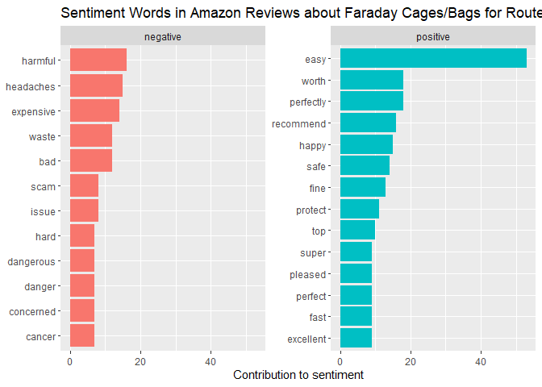
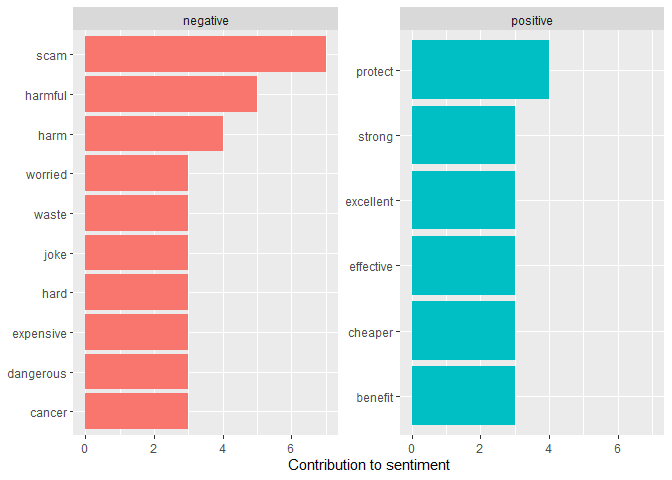
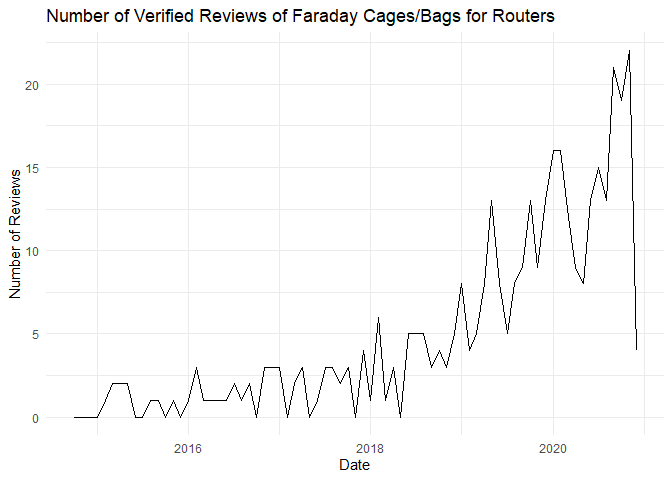
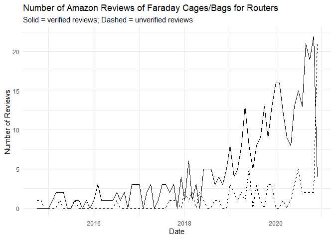

Setting Up the File

    library(tidyverse)
    library(rvest)
    library(tidytext)
    library(quanteda)
    #stop_words

    reviews <- read_csv("amazon_faraday_reviews.csv") 

    ## Warning: Missing column names filled in: 'X1' [1]

    reviews$review <- str_replace_all(reviews$review, "<U+0092>", "\'")
    reviews$title <- str_replace_all(reviews$title, "<U+0092>", "\'")

    #stop_words
    custom_stopwords <- data.frame(word = c("smart", "meter", "wifi", "router"), lexicon = "custom") %>%
      rbind(stop_words)

Preparation

    verified_reviews <- subset(reviews, reviews$verified == 1)
    verified_reviews_low <- reviews %>% subset(verified == 1) %>% subset(stars < 4)
    unverified_reviews <- subset(reviews, reviews$verified == 0)

Tokenize
========

    verified_bigram_ct <- unnest_tokens(verified_reviews, bigram, review, token = "ngrams", n = 2) %>%
      separate(bigram, c("word1", "word2"), sep = " ") %>%
      filter(!word1 %in% stop_words$word) %>%
      filter(!word2 %in% stop_words$word) %>%
      count(word1, word2, sort = TRUE)

    verified_bigram_ct

    ## # A tibble: 1,406 x 3
    ##    word1   word2      n
    ##    <chr>   <chr>  <int>
    ##  1 smart   meter     70
    ##  2 wifi    router    15
    ##  3 wifi    signal    14
    ##  4 meter   cover     13
    ##  5 cell    phone     12
    ##  6 wi      fi        12
    ##  7 emf     meter     11
    ##  8 rf      meter     11
    ##  9 router  guard     11
    ## 10 faraday cage      10
    ## # ... with 1,396 more rows

Bigram Analysis
===============

    unverified_bigram_ct <- unnest_tokens(unverified_reviews, bigram, review, token = "ngrams", n = 2) %>%
      separate(bigram, c("word1", "word2"), sep = " ") %>%
      filter(!word1 %in% stop_words$word) %>%
      filter(!word2 %in% stop_words$word) %>%
      count(word1, word2, sort = TRUE)

    unverified_bigram_ct

    ## # A tibble: 800 x 3
    ##    word1   word2                n
    ##    <chr>   <chr>            <int>
    ##  1 smart   meter               26
    ##  2 smart   meters              14
    ##  3 wifi    router              13
    ##  4 cell    phone               12
    ##  5 faraday cage                 8
    ##  6 signal  strength             7
    ##  7 wi      fi                   7
    ##  8 emf     radiation            4
    ##  9 https   smile.amazon.com     4
    ## 10 meter   cover                4
    ## # ... with 790 more rows

Sentiment Analysis
==================

    reviews %>% 
      unnest_tokens(word, review) %>%
      anti_join(custom_stopwords) %>%
      inner_join(get_sentiments("bing")) %>%
      count(word, sentiment, sort = TRUE) %>% 
      group_by(sentiment) %>%
      top_n(10) %>%
      ungroup() %>%
      mutate(word = reorder(word, n)) %>%
      ggplot(aes(n, word, fill = sentiment)) +
      geom_col(show.legend = FALSE) +
      facet_wrap(~sentiment, scales = "free_y") +
      labs(title = "Sentiment Words in Amazon Reviews about Faraday Cages/Bags for Routers",
        x = "Contribution to sentiment",
        y = NULL)

    ## Joining, by = "word"
    ## Joining, by = "word"

    ## Selecting by n

    unverified_reviews %>% 
      unnest_tokens(word, review) %>%
      anti_join(custom_stopwords) %>%
      inner_join(get_sentiments("bing")) %>%
      count(word, sentiment, sort = TRUE) %>% 
      group_by(sentiment) %>%
      top_n(6) %>%
      ungroup() %>%
      mutate(word = reorder(word, n)) %>%
      ggplot(aes(n, word, fill = sentiment)) +
      geom_col(show.legend = FALSE) +
      facet_wrap(~sentiment, scales = "free_y") +
      labs(x = "Contribution to sentiment",
           y = NULL)

    ## Joining, by = "word"
    ## Joining, by = "word"

    ## Selecting by n

Timeline
========

    verified_reviews$date <- strftime(verified_reviews$date, "%Y-%m") %>% paste0("-01") %>% as.Date()
    verified_timeline <- plyr::count(verified_reviews$date)
    index <- data.frame(x = seq.Date(as.Date("2014-10-01"), as.Date("2020-12-01"), by = "month"))
    timeline <- merge(verified_timeline, index, all = TRUE)
    timeline[is.na(timeline)] <- 0
    colnames(timeline)[1] <- "date"
    colnames(timeline)[2] <- "verified"

    ggplot(timeline, aes(x = date, y = verified)) +
      geom_line() +
      labs(title = "Number of Verified Reviews of Faraday Cages/Bags for Routers",
           x = "Date", y = "Number of Reviews") +
      theme_minimal()

    unverified_reviews$date <- strftime(unverified_reviews$date, "%Y-%m") %>% paste0("-01") %>% as.Date()
    unverified_timeline <- plyr::count(unverified_reviews$date)
    colnames(unverified_timeline)[1] <- "date"
    colnames(unverified_timeline)[2] <- "unverified"
    timeline2 <- merge(timeline, unverified_timeline, all = TRUE)
    timeline2[is.na(timeline2)] <- 0

    ggplot(timeline2, aes(x = date)) +
      geom_line(aes(y = unverified), linetype = "dashed") +
      geom_line(aes(y = verified), linetype = "solid") +
      labs(title = "Number of Amazon Reviews of Faraday Cages/Bags for Routers",
           subtitle = "Solid = verified reviews; Dashed = unverified reviews",
           x = "Date", y = "Number of Reviews") +
      theme_minimal()

